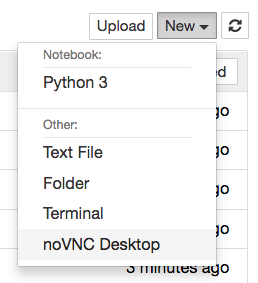

# nbnovnc

**nbnovnc** provides Jupyter server and notebook extensions to proxy a notebook-side VNC session using noVNC, enabling users to run non-web applications within their Jupyter notebook server. This is mostly useful for hosted Jupyter environments such as JupyterHub or Binder.

[](https://mybinder.org/v2/gh/ryanlovett/nbnovnc/master)



## Installation

### Install Dependencies
The extension requires [nbserverproxy](https://github.com/jupyterhub/nbserverproxy) and currently uses an opinionated VNC environment comprised of TightVNC server, noVNC, websockify, and supervisord.

On Debian/Ubuntu:
```
apt install tightvncserver novnc websockify supervisor
```

### Install nbnovnc 
Install the library:
```
pip install git+https://github.com/ryanlovett/nbnovnc
```

Either install the extensions for the user:
```
jupyter serverextension enable  --py nbnovnc
jupyter nbextension     install --py nbnovnc
jupyter nbextension     enable  --py nbnovnc
```

Or install the extensions for all users on the system:
```
jupyter serverextension enable  --py --sys-prefix nbnovnc
jupyter nbextension     install --py --sys-prefix nbnovnc
jupyter nbextension     enable  --py --sys-prefix nbnovnc
```

### Configuration

The following traitlets are available:

- NBNoVNC.desktop_session: The command used to start a desktop session. The default is `openbox --startup .config/openbox/autostart` because it is easy to prepare on binder.
- NBNoVNC.geometry: The desktop geometry, e.g. 1024x768.
- NBNoVNC.depth: The color depth, e.g. 24.

For example:
jupyter notebook --NBNoVNC.desktop_session /path/to/an/xinitrc
